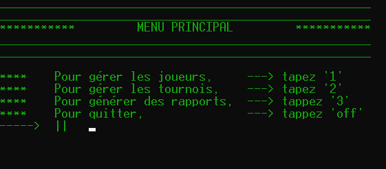
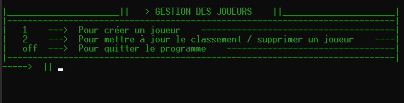
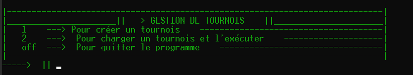
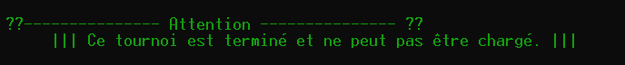
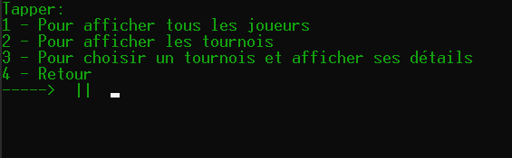

# Projet 4 - OpenClassrooms: Développez un programme logiciel en Python
  

## Ce programme permet de gérer hors-ligne l'organisation de tournois d'échec

Le programme permet de:
 * Gérer des joueurs
    * Créer des joueurs
    * Éditer le classement des joueurs
    * Supprimer les joueurs 
 * Gérer les évènements
    * Créer un tournois
    * Charger un tournois
 * Générer des rapports
    * Détaillants les joueurs enregistrées
    * Détaillants les tournois enregistrés
    * Affichant les détails d'un tournois

***
***    
## Sommaire
* [I. Installation du projet](#chapter1)
    * [Langage utilisé](#section1_1)
    * [Récupération du programme](#section1_2)
    * [Environnement virtuel](#section1_3)
    * [Installer les paquets](#section1_4)
* [II. Exécution du programme](#chapter2)
    * [ Gestionnaire de joueurs](#section2_1)
    * [ Gestionnaire de tournois](#section2_2)
    * [Création des rapports](#section2_3)
* [III. Initialisation du programme](#chapter3)
* [IV. Générer un rapports Flake8](#chapter4)

***
***

## I. Installation du projet 

### Langage utilisé **Python**. 
Ce script fonctionne au **minimum** sur la version **Python 3.4**.   

### Récupération du programme 
Les exemples sont écrit pour un terminal **Bash**.   
Ouvrir un terminal dans le dossier de destination et entrer la commande suivante pour télécharger le repository:   
  
    git clone https://github.com/Deadjuju/P4_OC.git

Il est possible de télécharger le fichier zip du programme   

### Environnement virtuel 
Ouvrir un terminal à la racine du dossier.  
  
     
  1. Taper la commande suivante pour générer l'environnement virtuel:  

    python -m venv env  

> *env* est le nom par défaut de l'environnement virtuel mais peut être nommé différemment.  
  
  2. Activer ensuite l'environnement virtuel:
    
    > Sur Windows  
    - terminal de type bash: source env/Scripts/activate
    - terminal de type shell: env\Scripts\activate
      
    > Sur Mac ou Linux
    - source env/bin/activate

### Installer les paquets 
  3. Pour installer les librairies supplémentaires exécuter la commande suivante:

    pip install -r requirements.txt

***  

## II. Exécution du programme 

Pour exécuter le programme rentrer la commande suivante dans le terminal:

         python main.py

  

Rentrer la commande correspondante à l'action voulue:

* 1 -> Pour ouvrir le gestionnaire des joueurs
* 2 -> Pour ouvrir le gestionnaire des tournois
* 3 -> Pour générer les rapports
* off -> pour quitter le programme

### 1°) Le gestionnaire des joueurs 

  

Le gestionnaire de joueurs permet    
* D'enregistrer un joueur dans la base de donnée    
-> En remplissant les champs demandés
* De sélectionner un joueur et 
    * changer son rang
    * le supprimer    

     

### 2°) Le gestionnaire des tournois 

  

Le gestionnaire de tournois permet
* D'enregistrer un nouveau tournoi dans la base de donnée
* De sélectionner un tournois existant afin d'exécuter un tour:
    * Si le tournois est terminé, il ne se charge pas, un message d'avertissement s'affiche
      
    * Une fois le tournois sélectionné, un tour est exécuté:
        * Les matchs sont générés
        * A la fin des matchs les résultats sont entrés par l'utilisateur
    * A la fin du tour, les résultats sont sauvegardés.

### 3°) Générer les rapports 
    
  

Plusieurs types de rapports peuvent-être générés:

* La liste de tous les joueurs
    * Classés selon leur rang
    * Classés alphabétiquement
* La liste de tous les tournois
* Pour un tournois sélectionné
    * Liste de tous les joueurs
        * Classés selon leur rang
        * Classés alphabétiquement
    * Liste de tous les tours
    * Liste de tous les matchs    
    
***

## III. Initialisation du programme 

Par défaut le nombre de joueus par tournois est fixé à 8 et le nombre de tours à 4.
Ces valeurs peuvent-être modifié dans le fichier 
> initialisation.py

>DEFAULT_NUMBER_OF_TURNS = "nombre de tours"  
>NUMBERS_OF_PLAYERS = "nombre de joueurs"

***

## IV. Générer un rapport flake8 

flake8 permet d'éplucher le code écrit et de repérer les erreurs de syntaxes et les non conformités avec la PEP.  
Un rapport html contenant les éventuelles erreurs peut-être généré.  

Il se trouve à la racine du dossier dans le dossier:    

> - flake8_rapport
>   - index.html

Un nouveau rapport peut-être généré en exécutant la commande suivante dans le terminal:

    flake8 --format=html --htmldir=flake8_rapport

